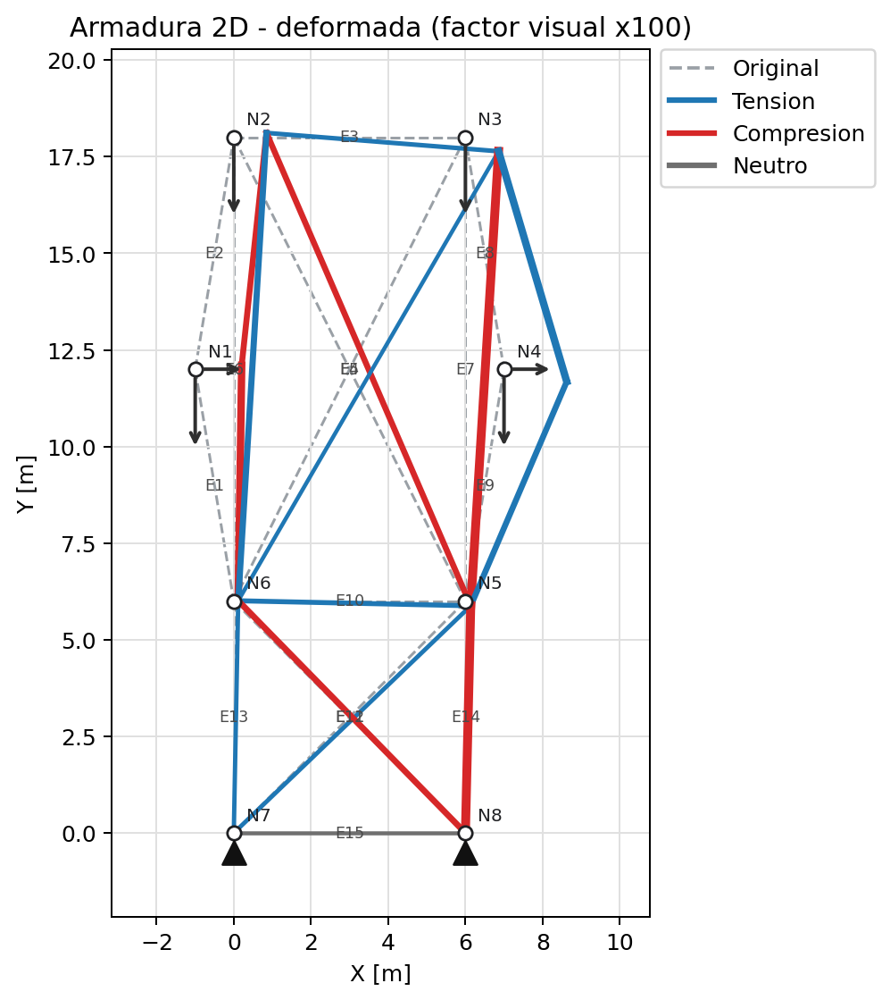
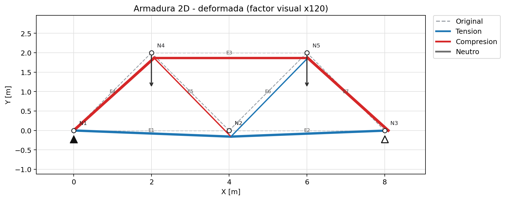

# Analisis matricial de armaduras planas

Proyecto Python para resolver armaduras planas 2D mediante el metodo matricial
de rigidez. El codigo fue refactorizado desde un script monolitico hacia una
estructura modular, testeable y apta para presentacion en GitHub.

## Caracteristicas

- Modelado tipado de nodos, elementos, cargas y desplazamientos prescritos.
- Ensamble eficiente de la matriz de rigidez global con NumPy.
- Resolucion numerica con `np.linalg.solve`, evitando invertir matrices de forma
  explicita.
- Calculo de desplazamientos, reacciones y fuerzas axiales por elemento.
- Validaciones para nodos inexistentes, elementos duplicados, longitud cero,
  propiedades no positivas y desplazamientos prescritos inconsistentes.
- Diagnosticos previos para detectar nodos aislados, barras de longitud cero,
  apoyos insuficientes y conteos principales del modelo.
- Visualizacion 2D de geometria original, deformada amplificada, cargas,
  apoyos y fuerzas internas por tension/compresion.
- Pruebas de regresion que conservan los resultados del script original.

## Estructura

```text
armadura_matricial/
|-- src/
|   `-- analisis_armadura/
|       |-- __init__.py
|       |-- __main__.py
|       |-- cli.py
|       |-- data.py
|       |-- diagnostics.py
|       |-- interactive.py
|       |-- models.py
|       |-- presentation.py
|       |-- visualization.py
|       `-- solver.py
|-- tests/
|-- examples/
|   |-- analisis_interactivo.py
|   |-- caso_base.py
|   |-- graficar_caso_base.py
|   `-- graficar_warren.py
|-- outputs/
|   `-- figures/
|-- README.md
|-- requirements.txt
|-- pyproject.toml
`-- .gitignore
```

## Metodo matricial

Cada barra se modela como un elemento axial con dos grados de libertad por nodo
en coordenadas globales: `DX` y `DY`. Para cada elemento se calcula:

1. Longitud `L` y cosenos directores `lx`, `ly`.
2. Matriz local:

```text
k_local = (A * E / L) * [[ 1, -1],
                         [-1,  1]]
```

3. Matriz de transformacion:

```text
T = [[lx, ly, 0,  0 ],
     [0,  0,  lx, ly]]
```

4. Matriz global del elemento:

```text
k_global_elemento = T.T @ k_local @ T
```

Luego, las matrices de cada elemento se ensamblan en la matriz global `K`. Los
grados de libertad libres se ubican primero y los restringidos al final, de modo
que el sistema particionado queda:

```text
[Kff Kfc] [Df] = [Ff]
[Kcf Kcc] [Dc]   [Fc]
```

Con los desplazamientos prescritos `Dc`, el sistema principal se resuelve como:

```text
Df = solve(Kff, Ff - Kfc @ Dc)
```

Las reacciones se obtienen con:

```text
R = Kcf @ Df + Kcc @ Dc - F_c_aplicadas
```

## Correccion de TensionCompresion

El script original construia el vector de desplazamientos del elemento a partir
de slices de NumPy con forma `(1,)`, generando arrays anidados y conversiones
ambiguas a escalares. En esta version, las fuerzas internas se calculan con
vectores 1D:

```python
element_displacements = displacements[np.array(member.dof_indices, dtype=int)]
local_displacements = member.transformation_matrix @ element_displacements
local_forces = member.local_stiffness_matrix @ local_displacements
axial_force = float(local_forces[1])
```

Esto elimina el problema de conversion de arrays a escalares y mantiene el mismo
resultado numerico.

## Instalacion

Desde la carpeta del proyecto, se recomienda crear un entorno virtual:

```powershell
py -3 -m venv .venv
.\.venv\Scripts\python -m pip install --upgrade pip
```

Instalacion simple para ejecutar ejemplos:

```powershell
.\.venv\Scripts\python -m pip install -r requirements.txt
```

Instalacion editable con herramientas de desarrollo:

```powershell
.\.venv\Scripts\python -m pip install -e ".[dev]"
```

La instalacion editable permite importar el paquete desde cualquier script local
y agrega herramientas como `pytest` y `ruff`.

## Ejecucion

Ejecutar el launcher principal:

```powershell
py Analisis_Armadura.py
```

La salida de consola muestra solo un resumen ejecutivo:

```text
Analisis completado correctamente
Numero de nodos: 8
Numero de elementos: 15
Desplazamiento maximo: 1.624 cm
Numero de reacciones calculadas: 4
```

Para trabajar programaticamente con el resultado completo:

```python
from Analisis_Armadura import main

resultado = main()
desplazamientos = resultado.global_displacements
reacciones = resultado.reactions
fuerzas_internas = resultado.internal_forces
```

Importar `Analisis_Armadura.py` no ejecuta el analisis; la ejecucion queda
encapsulada en `main()`.

Para trabajar interactivamente con el resultado devuelto por `main()`:

```powershell
py -i Analisis_Armadura.py
```

Ejecutar el ejemplo incluido, que imprime un resumen mas detallado:

```powershell
py -3 examples/caso_base.py
```

Ejecutar el menu interactivo para analizar casos de interes ingresando datos
por consola:

```powershell
py -3 examples/analisis_interactivo.py
```

Generar figuras de resultados:

```powershell
py -3 examples/graficar_caso_base.py
py -3 examples/graficar_warren.py
```

Las figuras se guardan automaticamente en `outputs/figures`.

Casos disponibles:

- Caso base con factor de carga.
- Armadura triangular simple con carga vertical en cumbrera.
- Armadura Warren de dos paneles con cargas superiores.
- Entrada manual completa de nodos, elementos, cargas y desplazamientos
  prescritos.

Ejemplo de sesion para una armadura triangular:

```text
Seleccione un caso [1-4]: 2
Luz de la armadura [m]: 6
Altura de cumbrera [m]: 2.5
Area de barras [m2]: [0.000416]
Modulo de elasticidad [kgf/m2]: [200000000]
Carga vertical descendente en N3 [kgf]: 10
```

Ejemplo de sesion para una armadura Warren:

```text
Seleccione un caso [1-4]: 3
Luz total de la Warren [m]: 8
Altura de la Warren [m]: 2
Area de barras [m2]: [0.000416]
Modulo de elasticidad [kgf/m2]: [200000000]
Carga descendente por nodo superior [kgf]: 8
```

El reporte interactivo usa el mismo formato profesional del proyecto:
desplazamientos en `cm`, reacciones en `kgf` y fuerzas internas en `kgf` con
identificacion de tension o compresion.

Tambien puede ejecutarse como modulo despues de instalarlo:

```powershell
py -3 -m analisis_armadura
```

## Ejemplo de uso

```python
from analisis_armadura import MatrixTrussAnalyzer, create_default_model, diagnose_model
from analisis_armadura.presentation import (
    format_detailed_report,
    format_diagnostics_report,
)

model = create_default_model()
diagnostics = diagnose_model(model)

print(format_diagnostics_report(diagnostics))

result = MatrixTrussAnalyzer(model).solve()

print(format_detailed_report(result))
```

## Diagnosticos estructurales

Antes de resolver el sistema, el proyecto puede generar un diagnostico rapido
del modelo:

```python
from analisis_armadura import create_default_model, diagnose_model
from analisis_armadura.presentation import format_diagnostics_report

model = create_default_model()
diagnostics = diagnose_model(model)

print(format_diagnostics_report(diagnostics))
```

El reporte incluye:

- Numero de nodos y elementos.
- Grados de libertad totales, libres y restringidos.
- Nodos aislados.
- Elementos con longitud cero.
- Apoyos que no restringen los tres movimientos rigidos planos.

Estos diagnosticos no reemplazan al solver ni modifican la formulacion
matricial; sirven para detectar problemas frecuentes de modelado antes de
intentar resolver el sistema.

## Visualizacion de resultados

La capa grafica vive en `analisis_armadura.visualization` y usa Matplotlib para
dibujar la geometria original, las cargas, los apoyos y la deformada
amplificada. El factor de deformada es estrictamente visual: los
desplazamientos del resultado se mantienen en sus unidades originales.

```python
from analisis_armadura import MatrixTrussAnalyzer, create_default_model, plot_truss

model = create_default_model()
result = MatrixTrussAnalyzer(model).solve()

plot_truss(
    model,
    result,
    deformation_scale=100.0,
    output_path="outputs/figures/caso_base_deformada.png",
)
```

Ejemplos generados:





## Resultados del caso base

Desplazamientos globales en centimetros:

```text
D1 = 1.205 cm
D2 = 0.104 cm
D3 = 0.846 cm
```

Reacciones en la unidad interna del modelo:

```text
N8 DX = -5.19 kgf
N8 DY = 22.00 kgf
N7 DX = -0.81 kgf
N7 DY = -2.00 kgf
```

Fuerzas internas por elemento:

```text
E1 (Compresion) = -11.66 kgf
E2 (Compresion) = -6.59 kgf
E3 (Tension) = 1.85 kgf
```

## Pruebas

Instalar dependencias de desarrollo:

```powershell
.\.venv\Scripts\python -m pip install -e ".[dev]"
```

Ejecutar pruebas:

```powershell
.\.venv\Scripts\python -m pytest
```

Ejecutar revision de calidad con Ruff:

```powershell
.\.venv\Scripts\python -m ruff check .
.\.venv\Scripts\python -m ruff format --check .
```

Las pruebas verifican que:

- Los desplazamientos desconocidos coinciden con el script original.
- Las reacciones coinciden con el script original.
- Las fuerzas internas redondeadas coinciden con `TensionCompresion()`.
- La fuerza interna se devuelve como arreglo 1D de escalares.
- El analizador detecta datos invalidos con excepciones claras.
- Los diagnosticos estructurales reportan nodos aislados, apoyos insuficientes,
  elementos de longitud cero y conteos del modelo.
- La visualizacion genera imagenes PNG y no muta los desplazamientos reales.

## Problemas detectados en el script original

- Codigo monolitico: datos, clases, calculo y ejecucion estaban mezclados.
- Nombres inconsistentes y varios metodos fuera de PEP8.
- Falta de type hints y docstrings completos.
- Uso de `np.linalg.inv`, menos estable que resolver el sistema lineal.
- Ensamble de rigidez con bucles anidados manuales.
- Manejo incompleto de apoyos parciales `DX` y `DY`.
- Riesgo de error en `TensionCompresion()` por arrays anidados y conversiones
  ambiguas a escalares.
- Validaciones insuficientes para datos estructurales invalidos.

## Mejoras aplicadas

- Separacion de responsabilidades en `models.py`, `solver.py`, `data.py` y
  `cli.py`.
- Objetos inmutables con `dataclass(frozen=True)` para los datos del modelo.
- Validaciones explicitas y excepciones de dominio.
- Ensamble matricial con indexacion avanzada de NumPy.
- Calculo de fuerzas internas con vectores 1D.
- Tests de regresion para proteger los resultados numericos.
- Documentacion tecnica, instrucciones de instalacion y ejemplo reproducible.
